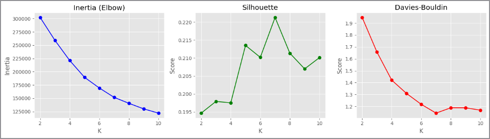

# 🚖 Análise de Corridas da Uber

Projeto de **Análise de Dados e Machine Learning** utilizando um dataset de corridas da Uber.

O objetivo deste projeto é explorar padrões nas corridas, analisar fatores relacionados a **cancelamentos** e aplicar técnicas de **classificação e clusterização** para extrair insights a partir dos dados.

---

# 🎓 Contexto do Projeto

Este projeto foi desenvolvido durante a **Trilha Rápida de Inteligência Artificial** do programa **SCTECH**, realizada em parceria com **SENAI/SC** e **LAB365**.

A atividade teve como objetivo aplicar técnicas práticas de:

* análise exploratória de dados
* modelagem de classificação
* avaliação de modelos
* clusterização

utilizando Python e bibliotecas de Machine Learning.

---

# 📊 Objetivos da Análise

* Explorar padrões nas corridas da Uber
* Investigar fatores associados a **corridas canceladas**
* Construir modelos de **Machine Learning**
* Avaliar desempenho dos modelos
* Identificar **agrupamentos de comportamento** nas corridas

---

# 🧠 Modelos de Machine Learning

Foram treinados diferentes modelos de classificação para prever o status da corrida (**Completed ou Cancel**).

### Modelos utilizados

* Baseline (classe majoritária)
* Regressão Logística
* Random Forest

### Métricas avaliadas

* Accuracy
* Precision
* Recall
* F1 Score
* Curva ROC
* Matriz de Confusão

---

# 🔍 Clusterização

Foi aplicado **K-Means** para identificar padrões de comportamento nas corridas.

A escolha do número de clusters foi avaliada utilizando:

* Método do Cotovelo (Inertia)
* Silhouette Score
* Davies-Bouldin Index

## Avaliação do Número de Clusters



A escolha do número de clusters foi avaliada utilizando:

- Método do Cotovelo (Inertia)
- Silhouette Score
- Davies-Bouldin Index

A análise indica que **K ≈ 7 clusters** oferece um bom equilíbrio entre separação e coesão dos grupos.

---

# 📁 Estrutura do Projeto

```
uber-rides-analysis/

notebooks/
│
├── analise-de-corridas-de-uber-p1.ipynb
├── analise-de-corridas-de-uber-p2.ipynb
└── analise-de-corridas-de-uber-p3.ipynb

outputs/
│
└── kmeans-evaluation.png

requirements.txt
.gitignore
README.md
```

---

# ⚙️ Tecnologias Utilizadas

* Python
* Pandas
* NumPy
* Scikit-learn
* Matplotlib
* Seaborn
* Jupyter Notebook

---

# 💻 Instalação das Dependências

Para instalar as bibliotecas necessárias:

```bash
pip install -r requirements.txt
```

---

# ▶️ Execução do Projeto

Os notebooks devem ser executados na seguinte ordem:

1. analise-de-corridas-de-uber-p1.ipynb
2. analise-de-corridas-de-uber-p2.ipynb
3. analise-de-corridas-de-uber-p3.ipynb

---

### 👩‍💻 Projeto desenvolvido como parte da formação em **Inteligência Artificial e Análise de Dados**.


